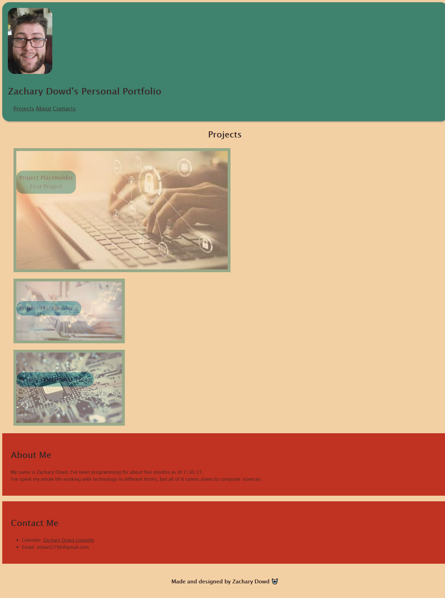

<br>
<p align="center">
   <h2 align="center">Zachary Dowd's Portfolio</h2>
</p>
<br>

## About the project
This is my personal portfolio site that will house all of my projects from the SMU bootcamp that I am participating in. I will be updating this portfolio regularly throughout the course. 

### How to view project

To view this project, simply go to https://zd092718.github.io/zdportfolio/ to view the finished product. 

To see the code for the site:

* Clone the repo

    ```sh
    git clone https://github.com/Zd092718/zdportfolio.git
    ```

### Built With

* HTML5
* CSS3 

### Preview Image



## Contact

Zachary Dowd - zdowd2796@gmail.com

Project Link - https://github.com/Zd092718/zdportfolio